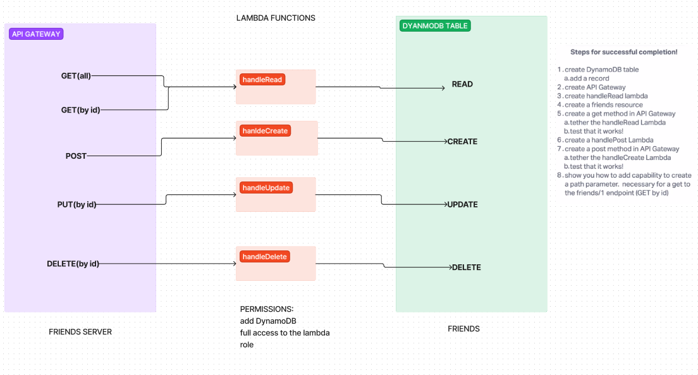

# LAB - 18

## Project: Serverless Api

### Author: Ike Steoger

### Feature Tasks

Create a single resource REST API using a domain model of your choosing, constructed using AWS Cloud Services. CRUD Operation Handlers: Lambda Functions

### Collaborators

Reece Renniger  
Kaeden O'maera  
Ryan Gallaway

### Documentation

#### Root URL to API

<https://cwu9kmqgx5.execute-api.us-west-2.amazonaws.com/lab18>

#### Routes To API

- GET `/people` - reads all people in DB, requires no input
- POST `/people` - adds new person to DB, requires a body input formatted in JSON
- GET `/people/{id}` - reads person by ID in DB, requires an ID#
- PUT `/people/{id}` - update person by ID in DB, requires an ID# and a body input formatted in JSON
- DELETE `/people/{id}` - deletes person by ID in DB, requires an ID#

#### UML

